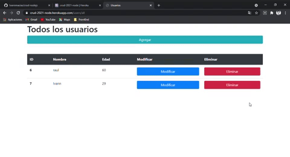
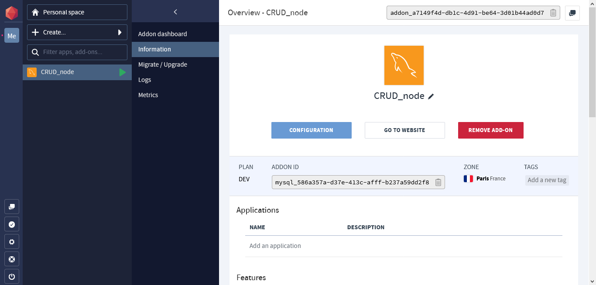

# **CRUD con Node.js**

## Descripción.
Se realizo un CRUD con Node.js por el cual se puede introducir el nombre y edad de la persona.

*- Interfaz Principal*.

## - Heroku

 Se uso un el hosting de Heroku
 
 
 
 ## - Clever Cloud
Se uso para subir la base de datos en la nube y se pueda enlazar con Heroku.

Dependencias usadas.

    npm i nodemon
    npm i mysql
    npm i ejs
    npm i express
    npm i dotenv
    
Hosting:
https://crud-2021-node.herokuapp.com/

Nota: Puede que no muestre la pagina al inicio ya que tarde unos minutos en realizar la conexion con la base de datos de Cleve Cloud.
